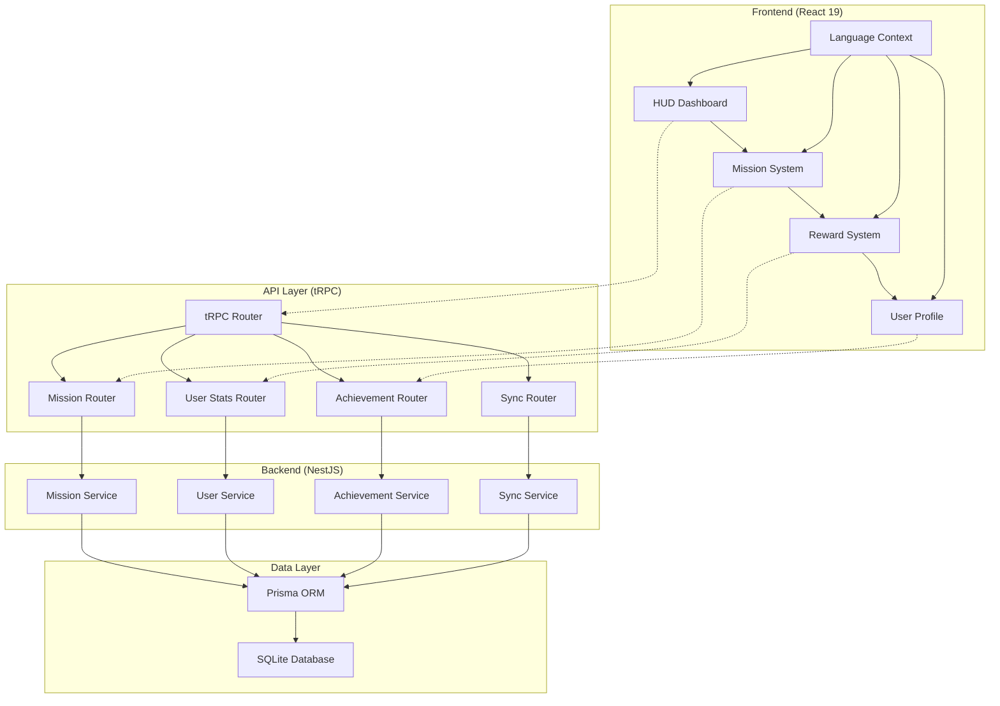

# Design Document - Starship Commander Core (Backend Focus)

## Overview

基于现有前端代码（React + TypeScript），本设计专注于后端架构适配和数据模式设计，确保后端 API 与前端组件完美对接。现有前端已实现舰桥控制台、任务卡片、结算弹窗等核心 UI 组件，需要构建对应的后端服务来支持这些功能。

设计重点：**后端 API 适配** + **数据模型设计** + **类型安全集成**，而非前端 UI 重新设计。

## Steering Document Alignment

### Technical Standards
- **全栈 TypeScript**: 确保类型安全和开发体验一致性
- **模块化架构**: 遵循 NestJS 的模块化设计模式
- **tRPC 类型安全**: 前后端 API 调用完全类型安全
- **React 19**: 利用最新的 React 特性和性能优化
- **Prisma ORM**: 类型安全的数据库访问和迁移

### Project Structure
```
src/
├── frontend/          # React 前端应用
│   ├── components/    # 可复用 UI 组件
│   ├── contexts/      # React Context 状态管理
│   ├── hooks/         # 自定义 React Hooks
│   ├── services/      # API 服务层
│   └── types/         # TypeScript 类型定义
├── backend/           # NestJS 后端应用
│   ├── modules/       # 业务模块
│   ├── services/      # 业务服务
│   ├── utils/         # 工具函数
│   └── trpc/          # tRPC 路由和配置
└── shared/            # 共享类型和工具
    ├── types/         # 共享类型定义
    └── constants/     # 共享常量
```

## Frontend Analysis & Backend Requirements

### 现有前端组件分析
基于对现有前端代码的分析，需要以下后端支持：

#### 前端已实现的核心组件
1. **HUD Component**: 
   - 显示用户等级、XP 进度条、CR 硬币
   - 需要后端提供用户统计数据接口

2. **MissionCard Component**: 
   - 显示任务信息、执行按钮、完成状态
   - 需要后端提供任务列表、任务执行、冷却状态管理

3. **SuccessOverlay Component**: 
   - 显示任务完成奖励动画
   - 需要后端计算并返回 XP 和 CR 奖励

4. **App.tsx 主组件**: 
   - 管理全局状态（missions, stats, historyLog）
   - 需要后端支持数据持久化和同步

### Backend API Requirements

#### 前端现有数据结构适配
```typescript
// 前端 Mission 类型 (需要后端支持)
interface Mission {
  id: string;
  title: { en: string, zh: string };
  description: { en: string, zh: string };
  xpReward: number;
  coinReward: number;
  isCompleted: boolean;
  category: MissionCategory; // BODY | BRAIN | BASE
  emoji: string;
  isDaily: boolean;
  streak: number;
}

// 前端 UserStats 类型 (需要后端支持)
interface UserStats {
  level: number;
  currentXp: number;
  maxXp: number;
  coins: number;
  totalMissionsCompleted: number;
  totalXpEarned: number;
  rank: string;
}
```

#### 必需的后端 API 接口
1. **用户数据获取**: GET /trpc/user.getStats
2. **任务列表获取**: GET /trpc/mission.getMissions  
3. **任务执行**: POST /trpc/mission.completeMission
4. **任务创建**: POST /trpc/mission.createMission (用户自定义)
5. **历史记录**: GET /trpc/user.getHistory
6. **数据同步**: POST /trpc/sync.upload

## Architecture

### 整体架构设计



### 模块化设计原则

#### 前端模块化
- **单一文件职责**: 每个组件文件专注于单一功能领域
- **组件隔离**: 创建小型、专注的组件而非大型单体文件
- **服务层分离**: 分离数据访问、业务逻辑和表现层
- **工具模块化**: 将工具函数分解为专注的单一目的模块

#### 后端模块化
- **模块独立性**: 每个业务模块独立，具有清晰的边界
- **依赖注入**: 使用 NestJS 的 DI 容器管理依赖关系
- **接口抽象**: 定义清晰的接口契约，便于测试和维护
- **错误处理**: 统一的错误处理和响应格式

## Backend Services & API Design

### 核心 tRPC 路由设计

#### 1. UserStats Service
- **Purpose:** 用户统计数据管理，支持前端 HUD 组件数据需求
- **API 接口:**
  ```typescript
  export const userRouter = t.router({
    getStats: t.procedure
      .query(async ({ ctx }) => {
        // 返回用户等级、XP、CR 等数据
        return await userStatsService.getUserStats(ctx.userId);
      }),
      
    updateStats: t.procedure
      .input(z.object({
        xp: z.number().optional(),
        coins: z.number().optional(),
        level: z.number().optional()
      }))
      .mutation(async ({ input, ctx }) => {
        // 更新用户统计数据
        return await userStatsService.updateUserStats(ctx.userId, input);
      }),
      
    getHistory: t.procedure
      .input(z.object({
        limit: z.number().default(20),
        offset: z.number().default(0)
      }))
      .query(async ({ input, ctx }) => {
        // 获取任务历史记录
        return await userStatsService.getMissionHistory(ctx.userId, input);
      })
  });
  ```

#### 2. Mission Service  
- **Purpose:** 任务管理，支持前端 MissionCard 组件的完整生命周期
- **API 接口:**
  ```typescript
  export const missionRouter = t.router({
    getMissions: t.procedure
      .input(z.object({
        category: z.enum(['BODY', 'BRAIN', 'BASE']).optional(),
        isCompleted: z.boolean().optional()
      }))
      .query(async ({ input, ctx }) => {
        // 返回任务列表，支持分类筛选
        return await missionService.getMissions(ctx.userId, input);
      }),
      
    completeMission: t.procedure
      .input(z.object({ missionId: z.string() }))
      .mutation(async ({ input, ctx }) => {
        // 执行任务完成逻辑，返回奖励数据
        return await missionService.completeMission(ctx.userId, input.missionId);
      }),
      
    createMission: t.procedure
      .input(z.object({
        title: z.record(z.string()),
        description: z.record(z.string()),
        category: z.enum(['BODY', 'BRAIN', 'BASE']),
        xpReward: z.number(),
        coinReward: z.number(),
        emoji: z.string(),
        isDaily: z.boolean()
      }))
      .mutation(async ({ input, ctx }) => {
        // 创建用户自定义任务
        return await missionService.createMission(ctx.userId, input);
      })
  });
  ```

#### 3. Sync Service
- **Purpose:** 数据同步，支持离线使用和多设备同步
- **API 接口:**
  ```typescript
  export const syncRouter = t.router({
    syncData: t.procedure
      .input(z.object({
        lastSyncAt: z.date().optional()
      }))
      .query(async ({ input, ctx }) => {
        // 返回需要同步的数据
        return await syncService.getSyncData(ctx.userId, input.lastSyncAt);
      }),
      
    uploadOfflineActions: t.procedure
      .input(z.object({
        actions: z.array(z.object({
          type: z.string(),
          data: z.any(),
          timestamp: z.date()
        }))
      }))
      .mutation(async ({ input, ctx }) => {
        // 处理离线操作同步
        return await syncService.processOfflineActions(ctx.userId, input.actions);
      })
  });
  ```

### Backend Services

#### 1. MissionService
- **Purpose:** 任务管理业务逻辑，处理任务创建、执行、冷却等
- **Interfaces:**
  ```typescript
  interface IMissionService {
    getMissions(userId: string): Promise<Mission[]>;
    completeMission(userId: string, missionId: string): Promise<RewardResult>;
    checkCooldowns(userId: string): Promise<Mission[]>;
  }
  ```
- **Dependencies:** Prisma Mission Model, User Service, Reward Calculator
- **Reuses:** 现有 Mission Module，添加冷却机制和业务规则

#### 2. UserStatsService
- **Purpose:** 用户统计数据管理，处理等级、XP、成就等
- **Interfaces:**
  ```typescript
  interface IUserStatsService {
    getUserStats(userId: string): Promise<UserStats>;
    updateUserStats(userId: string, updates: Partial<UserStats>): Promise<UserStats>;
    checkLevelUp(stats: UserStats): Promise<boolean>;
  }
  ```
- **Dependencies:** Prisma UserStats Model, Achievement Service
- **Reuses:** 现有用户统计逻辑，扩展等级系统和成就检查

#### 3. SyncService
- **Purpose:** 数据同步服务，处理跨设备数据同步和离线支持
- **Interfaces:**
  ```typescript
  interface ISyncService {
    syncUserData(userId: string, lastSync?: Date): Promise<SyncResult>;
    handleOfflineActions(userId: string, actions: OfflineAction[]): Promise<void>;
  }
  ```
- **Dependencies:** UserStatsService, MissionService, Timestamp Management
- **Reuses:** 新增服务，实现数据持久化和同步逻辑

## Data Models - 适配前端需求

### Prisma Schema 设计（基于前端数据结构）

```prisma
// 任务模型 - 完全适配前端 Mission 接口
model Mission {
  id          String   @id @default(cuid())
  title       Json     // {"en": "Brush Teeth", "zh": "刷牙"}
  description Json     // {"en": "Keep your teeth healthy", "zh": "保持牙齿健康"}
  xpReward    Int
  coinReward  Int
  category    Category // BODY | BRAIN | BASE (对应前端枚举)
  emoji       String   // 任务图标
  isDaily     Boolean  @default(false)
  streak      Int      @default(0) // 连续完成天数
  isActive    Boolean  @default(true)
  createdAt   DateTime @default(now())
  updatedAt   DateTime @updatedAt

  // 用户任务关联
  userMissions UserMission[]
}

// 用户任务关联表 - 支持任务完成状态
model UserMission {
  id           String    @id @default(cuid())
  userId       String
  missionId    String
  isCompleted  Boolean   @default(false)
  completedAt  DateTime?
  streak       Int       @default(0)
  lastCompleted DateTime?
  cooldownUntil DateTime? // 冷却结束时间
  createdAt    DateTime  @default(now())
  updatedAt    DateTime  @updatedAt

  mission Mission @relation(fields: [missionId], references: [id])
  
  @@unique([userId, missionId])
}

// 用户统计数据 - 完全适配前端 UserStats 接口
model UserStats {
  id                      String   @id @default(cuid())
  userId                  String   @unique
  level                   Int      @default(1)
  currentXp               Int      @default(0)
  maxXp                   Int      @default(100)
  coins                   Int      @default(0)
  totalMissionsCompleted  Int      @default(0)
  totalXpEarned           Int      @default(0)
  currentStreak           Int      @default(0)
  longestStreak           Int      @default(0)
  rank                    Rank     @default(CADET) // 对应前端 rank 字段
  lastActive              DateTime @default(now())
  preferredLang           String   @default("en") // en | zh
  createdAt               DateTime @default(now())
  updatedAt               DateTime @updatedAt

  // 关联关系
  missionHistory MissionHistory[]
}

// 任务历史记录 - 支持 CaptainsLog 组件
model MissionHistory {
  id            String   @id @default(cuid())
  userId        String
  missionId     String
  missionTitle  Json     // 任务标题快照（支持多语言）
  xpEarned      Int
  coinEarned    Int
  category      Category
  timestamp     DateTime @default(now())

  userStats     UserStats @relation(fields: [userId], references: [id])
}

// 枚举定义 - 完全匹配前端
enum Category {
  BODY    // 机体健康类
  BRAIN   // 脑力学习类
  BASE    // 基地家务类
}

enum Rank {
  CADET      // 学员
  LIEUTENANT // 中尉  
  CAPTAIN    // 舰长
  COMMANDER  // 指挥官
}
```

### 类型同步 - 前后端共享类型

```typescript
// src/shared/types.ts - 前后端共享
export interface Mission {
  id: string;
  title: LocalizedString;
  description: LocalizedString;
  xpReward: number;
  coinReward: number;
  isCompleted: boolean;
  category: Category;
  emoji: string;
  isDaily: boolean;
  streak: number;
}

export interface UserStats {
  level: number;
  currentXp: number;
  maxXp: number;
  coins: number;
  totalMissionsCompleted: number;
  totalXpEarned: number;
  rank: string;
}

export interface LocalizedString {
  en: string;
  zh: string;
}

export type Category = 'BODY' | 'BRAIN' | 'BASE';
```

### tRPC 路由定义

```typescript
// 任务路由
export const missionRouter = t.router({
  getMissions: t.procedure
    .input(z.object({ category: z.enum(['BODY', 'BRAIN', 'BASE']).optional() }))
    .query(({ input, ctx }) => missionService.getMissions(ctx.userId, input)),
    
  completeMission: t.procedure
    .input(z.object({ missionId: z.string() }))
    .mutation(({ input, ctx }) => missionService.completeMission(ctx.userId, input.missionId)),
    
  createMission: t.procedure
    .input(z.object({
      title: z.record(z.string()),
      category: z.enum(['BODY', 'BRAIN', 'BASE']),
      difficulty: z.enum(['EASY', 'MEDIUM', 'HARD']),
      xpReward: z.number(),
      coinReward: z.number(),
      emoji: z.string(),
      duration: z.number().optional(),
      isDaily: z.boolean().default(false)
    }))
    .mutation(({ input, ctx }) => missionService.createMission(ctx.userId, input))
});

// 用户统计路由
export const userStatsRouter = t.router({
  getStats: t.procedure
    .query(({ ctx }) => userStatsService.getUserStats(ctx.userId)),
    
  updateSettings: t.procedure
    .input(z.object({
      preferredLang: z.enum(['en', 'zh']),
      avatar: z.string().optional()
    }))
    .mutation(({ input, ctx }) => userStatsService.updateSettings(ctx.userId, input))
});

// 数据同步路由
export const syncRouter = t.router({
  sync: t.procedure
    .input(z.object({ lastSync: z.date().optional() }))
    .query(({ input, ctx }) => syncService.syncUserData(ctx.userId, input.lastSync)),
    
  uploadOfflineActions: t.procedure
    .input(z.object({ actions: z.array(z.any()) }))
    .mutation(({ input, ctx }) => syncService.handleOfflineActions(ctx.userId, input.actions))
});
```

## Error Handling

### 错误场景和处理策略

1. **任务执行失败**
   - **场景**: 网络中断、任务不存在、冷却中
   - **处理**: 本地缓存状态，网络恢复后自动同步
   - **用户影响**: 显示"同步中"状态，允许继续使用应用

2. **数据同步冲突**
   - **场景**: 多设备同时操作导致数据冲突
   - **处理**: 时间戳优先策略，保留最新操作记录
   - **用户影响**: 透明处理，后台自动解决冲突

3. **等级计算错误**
   - **场景**: XP计算异常、等级边界条件
   - **处理**: 服务端重新计算，客户端状态校正
   - **用户影响**: 可能出现"数据校正中"提示

4. **离线模式限制**
   - **场景**: 长时间离线无法同步数据
   - **处理**: 本地存储操作队列，限制离线时长
   - **用户影响**: 提示网络连接，部分功能受限

## Testing Strategy

### 单元测试 (Unit Testing)
- **核心组件测试**: HUD、MissionCard、RewardOverlay 等核心组件
- **业务逻辑测试**: 任务完成、XP计算、等级提升逻辑
- **工具函数测试**: 数据格式化、时间处理、状态计算
- **覆盖率目标**: 核心业务逻辑 > 90%

### 集成测试 (Integration Testing)
- **API 集成测试**: tRPC 路由端到端测试
- **数据库集成测试**: Prisma 操作和数据一致性
- **组件集成测试**: 组件间数据流和状态管理
- **同步功能测试**: 离线操作和在线同步流程

### 端到端测试 (E2E Testing)
- **用户场景测试**: 
  - 新用户注册和首次使用流程
  - 任务执行和奖励获取完整流程
  - 多设备数据同步验证
  - 等级提升和成就解锁体验
- **性能测试**: 
  - 大量任务数据下的响应时间
  - 动画效果的流畅性测试
  - 内存使用和泄漏检测

### 测试工具链
- **前端**: Jest + React Testing Library + Cypress
- **后端**: Jest + Supertest + Prisma Test Environment  
- **类型检查**: TypeScript strict 模式 + ESLint
- **性能测试**: Lighthouse + Web Vitals monitoring