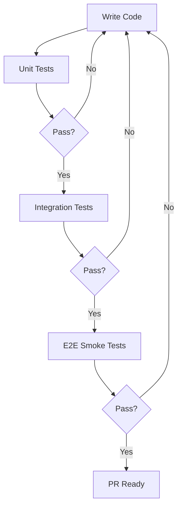

# Test Design: E2E Test Suite - Mission Management
# 测试设计：E2E 测试套件 - 任务管理

**Date**: 2025-12-23
**Designer**: Quinn (Test Architect)
**Version**: 1.0

---

## Executive Summary / 执行摘要

### Current State / 当前状态
- **Total Tests**: 17 (all E2E)
- **Coverage**: 17/17 requirements (100%)
- **Test Pyramid**: ⚠️ Severely imbalanced (E2E: 100%, Integration: 0%, Unit: 6%)
- **Execution Time**: 36.8s

### Target State / 目标状态
- **Total Scenarios**: 68 (Unit: 35, Integration: 16, E2E: 17)
- **Test Pyramid**: ✅ Balanced (Unit: 51%, Integration: 24%, E2E: 25%)
- **Target Execution Time**: < 60s total

### Key Improvements / 关键改进
1. Add 35 unit tests for fast feedback on business logic
2. Add 16 integration tests for API and database interactions
3. Optimize E2E tests (parallel execution, reduce redundancy)
4. Implement security and performance testing

---

## Test Strategy Overview / 测试策略概览

### Test Distribution / 测试分布

| Test Level | Current | Target | Priority Breakdown |
|------------|---------|--------|-------------------|
| **Unit** | 1 (6%) | 35 (51%) | P0: 15, P1: 12, P2: 8 |
| **Integration** | 0 (0%) | 16 (24%) | P0: 8, P1: 5, P2: 3 |
| **E2E** | 17 (100%) | 17 (25%) | P0: 8, P1: 6, P2: 3 |
| **Total** | 18 | 68 | P0: 31, P1: 23, P2: 14 |

### Test Pyramid Visualization / 测试金字塔

```
Target Pyramid:              Current State:
         E2E (17) ████             E2E (17) ████████████████ 100%
   Integration (16) ██████       Integration (0) _____________ 0%
      Unit (35) ███████████       Unit (1) █ 6%
```

### Priority Distribution / 优先级分布

| Priority | Count | Percentage | Description |
|----------|-------|------------|-------------|
| **P0** | 31 | 46% | Revenue-critical, security, core journeys |
| **P1** | 23 | 34% | Frequently used features, important flows |
| **P2** | 14 | 20% | Secondary features, edge cases |

---

## Test Level Framework / 测试层次框架

### Unit Tests (单元测试)

**Purpose**: Validate pure business logic in isolation
**Execution Time**: < 5ms per test
**Total Time**: < 200ms for 35 tests

**When to Use**:
- ✅ Pure functions and algorithms
- ✅ Validation logic
- ✅ Calculations and transformations
- ✅ Error handling logic
- ❌ Database operations
- ❌ Network calls
- ❌ UI rendering

---

### Integration Tests (集成测试)

**Purpose**: Validate component interactions
**Execution Time**: < 100ms per test
**Total Time**: < 2s for 16 tests

**When to Use**:
- ✅ API endpoints with database
- ✅ Service layer interactions
- ✅ Database transactions
- ✅ External service integrations
- ❌ Full user journeys (use E2E)
- ❌ Pure logic (use unit)

---

### E2E Tests (端到端测试)

**Purpose**: Validate critical user journeys
**Execution Time**: < 5s per test
**Total Time**: < 30s for 17 tests (with parallelization)

**When to Use**:
- ✅ Critical user paths
- ✅ Multi-component workflows
- ✅ Compliance requirements
- ❌ Individual component logic (use unit/integration)

---

## Test Scenarios by Requirement / 按需求的测试场景

### REQ-1: Application Initialization / 应用初始化

**Current Coverage**: 2 E2E tests
**Gap**: Missing unit tests for initialization logic

#### Scenarios / 场景

| ID | Level | Priority | Test | Justification | Status |
|----|-------|----------|------|---------------|--------|
| E2E-001 | E2E | P1 | Application loads with valid user | Critical path validation | ✅ Exists |
| E2E-002 | E2E | P1 | User data displays correctly on HUD | UI integration validation | ✅ Exists |
| UNIT-001 | Unit | P2 | Format XP display string | Pure formatting logic | 🔴 Missing |
| UNIT-002 | Unit | P2 | Calculate user level from XP | Calculation logic | 🔴 Missing |

---

### REQ-2: Mission Creation - Valid Mission / 任务创建 - 有效任务

**Current Coverage**: 1 E2E test
**Gap**: Missing unit and integration tests for validation and service logic

#### Scenarios / 场景

| ID | Level | Priority | Test | Justification | Status |
|----|-------|----------|------|---------------|--------|
| E2E-003 | E2E | P0 | User creates mission via API | Critical user journey | ✅ Exists |
| INT-001 | Integration | P0 | API validates and persists mission | Service + DB integration | 🔴 Missing |
| UNIT-003 | Unit | P0 | Validate mission data structure | Schema validation | 🔴 Missing |
| UNIT-004 | Unit | P0 | Validate required fields | Input validation | 🔴 Missing |
| UNIT-005 | Unit | P1 | Generate mission ID | ID generation logic | 🔴 Missing |

---

### REQ-3: Difficulty-Reward Matching / 难度奖励匹配

**Current Coverage**: 1 E2E test
**Gap**: Missing unit tests for validation logic

#### Scenarios / 场景

| ID | Level | Priority | Test | Justification | Status |
|----|-------|----------|------|---------------|--------|
| E2E-004 | E2E | P1 | Reject mismatched rewards via API | End-to-end validation | ✅ Exists |
| UNIT-006 | Unit | P0 | validateRewardsMatchDifficulty() | Pure validation logic | 🔴 Missing |
| UNIT-007 | Unit | P1 | Get reward range for difficulty | Configuration lookup | 🔴 Missing |
| UNIT-008 | Unit | P1 | Calculate reward validation error message | Error formatting | 🔴 Missing |

---

### REQ-4: Empty Title Validation / 空标题验证

**Current Coverage**: 1 E2E test
**Gap**: Missing unit test for validation logic

#### Scenarios / 场景

| ID | Level | Priority | Test | Justification | Status |
|----|-------|----------|------|---------------|--------|
| E2E-005 | E2E | P1 | Reject empty title via API | Integration validation | ✅ Exists |
| UNIT-009 | Unit | P0 | Trim and validate title string | Pure validation logic | 🔴 Missing |

---

### REQ-5: Emoji Validation / Emoji 验证

**Current Coverage**: 1 E2E test
**Gap**: Missing unit test for emoji regex validation

#### Scenarios / 场景

| ID | Level | Priority | Test | Justification | Status |
|----|-------|----------|------|---------------|--------|
| E2E-006 | E2E | P1 | Reject invalid emoji via API | Integration validation | ✅ Exists |
| UNIT-010 | Unit | P0 | validateEmoji() with valid emoji | Regex validation | 🔴 Missing |
| UNIT-011 | Unit | P0 | validateEmoji() with invalid emoji | Regex validation | 🔴 Missing |
| UNIT-012 | Unit | P1 | validateEmoji() with empty string | Edge case | 🔴 Missing |
| UNIT-013 | Unit | P2 | validateEmoji() with multiple emojis | Edge case | 🔴 Missing |

---

### REQ-6: Duplicate Detection / 重复检测

**Current Coverage**: 1 E2E test
**Gap**: Missing integration test for database uniqueness constraint

#### Scenarios / 场景

| ID | Level | Priority | Test | Justification | Status |
|----|-------|----------|------|---------------|--------|
| E2E-007 | E2E | P0 | Prevent duplicate mission titles | Critical data integrity | ✅ Exists |
| INT-002 | Integration | P0 | Database enforces unique constraint | DB constraint validation | 🔴 Missing |
| UNIT-014 | Unit | P1 | Normalize title for comparison | String normalization | 🔴 Missing |

---

### REQ-7: All Difficulty Levels / 所有难度级别

**Current Coverage**: 1 E2E test (3 scenarios)
**Gap**: Missing unit tests for difficulty configuration

#### Scenarios / 场景

| ID | Level | Priority | Test | Justification | Status |
|----|-------|----------|------|---------------|--------|
| E2E-008 | E2E | P1 | Create EASY difficulty mission | User journey | ✅ Exists |
| E2E-009 | E2E | P1 | Create MEDIUM difficulty mission | User journey | ✅ Exists |
| E2E-010 | E2E | P1 | Create HARD difficulty mission | User journey | ✅ Exists |
| UNIT-015 | Unit | P1 | Get reward range for EASY | Configuration lookup | 🔴 Missing |
| UNIT-016 | Unit | P1 | Get reward range for MEDIUM | Configuration lookup | 🔴 Missing |
| UNIT-017 | Unit | P1 | Get reward range for HARD | Configuration lookup | 🔴 Missing |

---

### REQ-8: Boundary Values / 边界值

**Current Coverage**: 1 E2E test (4 scenarios)
**Gap**: Missing unit tests for boundary validation

#### Scenarios / 场景

| ID | Level | Priority | Test | Justification | Status |
|----|-------|----------|------|---------------|--------|
| E2E-011 | E2E | P1 | Accept EASY minimum values | Boundary validation | ✅ Exists |
| E2E-012 | E2E | P1 | Accept EASY maximum values | Boundary validation | ✅ Exists |
| E2E-013 | E2E | P1 | Reject below minimum | Boundary validation | ✅ Exists |
| E2E-014 | E2E | P1 | Reject above maximum | Boundary validation | ✅ Exists |
| UNIT-018 | Unit | P0 | Validate minimum boundary (10 XP, 5 coins) | Pure validation | 🔴 Missing |
| UNIT-019 | Unit | P0 | Validate maximum boundary (50 XP, 25 coins) | Pure validation | 🔴 Missing |

---

### REQ-9: All Categories / 所有类别

**Current Coverage**: 1 E2E test (4 scenarios)
**Gap**: Missing unit tests for category configuration

#### Scenarios / 场景

| ID | Level | Priority | Test | Justification | Status |
|----|-------|----------|------|---------------|--------|
| E2E-015 | E2E | P1 | Create study category mission | User journey | ✅ Exists |
| E2E-016 | E2E | P1 | Create health category mission | User journey | ✅ Exists |
| E2E-017 | E2E | P1 | Create chore category mission | User journey | ✅ Exists |
| E2E-018 | E2E | P1 | Create creative category mission | User journey | ✅ Exists |
| UNIT-020 | Unit | P2 | Validate category enum | Enum validation | 🔴 Missing |

---

### REQ-10: String Length Limits / 字符串长度限制

**Current Coverage**: 1 E2E test (2 scenarios)
**Gap**: Missing unit tests for length validation

#### Scenarios / 场景

| ID | Level | Priority | Test | Justification | Status |
|----|-------|----------|------|---------------|--------|
| E2E-019 | E2E | P1 | Reject title > 100 chars | Integration validation | ✅ Exists |
| E2E-020 | E2E | P1 | Reject description > 500 chars | Integration validation | ✅ Exists |
| UNIT-021 | Unit | P0 | Validate title min length (1 char) | Length validation | 🔴 Missing |
| UNIT-022 | Unit | P0 | Validate title max length (100 chars) | Length validation | 🔴 Missing |
| UNIT-023 | Unit | P0 | Validate description min length (1 char) | Length validation | 🔴 Missing |
| UNIT-024 | Unit | P0 | Validate description max length (500 chars) | Length validation | 🔴 Missing |

---

### REQ-11: Authentication - Unauthenticated User / 认证 - 未认证用户

**Current Coverage**: 1 E2E test
**Gap**: Missing integration tests for authentication middleware

#### Scenarios / 场景

| ID | Level | Priority | Test | Justification | Status |
|----|-------|----------|------|---------------|--------|
| E2E-021 | E2E | P0 | Reject request without x-user-id | Security validation | ✅ Exists |
| INT-003 | Integration | P0 | Auth middleware extracts user ID | Middleware logic | 🔴 Missing |
| INT-004 | Integration | P1 | Reject invalid user ID format | Input validation | 🔴 Missing |
| UNIT-025 | Unit | P1 | Extract user ID from headers | Header parsing logic | 🔴 Missing |

---

### REQ-12: API Error Response Format / API 错误响应格式

**Current Coverage**: 1 E2E test
**Gap**: Missing unit tests for error formatting

#### Scenarios / 场景

| ID | Level | Priority | Test | Justification | Status |
|----|-------|----------|------|---------------|--------|
| E2E-022 | E2E | P1 | Return consistent error format | API contract validation | ✅ Exists |
| UNIT-026 | Unit | P0 | Format validation error message | Error formatting | 🔴 Missing |
| UNIT-027 | Unit | P0 | Format tRPC error response | Error formatting | 🔴 Missing |

---

### REQ-13: Mission List Display / 任务列表显示

**Current Coverage**: 1 E2E test
**Gap**: Missing integration tests for API response

#### Scenarios / 场景

| ID | Level | Priority | Test | Justification | Status |
|----|-------|----------|------|---------------|--------|
| E2E-023 | E2E | P0 | Display mission cards in UI | Critical user journey | ✅ Exists |
| INT-005 | Integration | P0 | API returns active missions | API + DB integration | 🔴 Missing |
| INT-006 | Integration | P1 | Filter missions by category | Query filtering | 🔴 Missing |
| INT-007 | Integration | P1 | Filter missions by isDaily flag | Query filtering | 🔴 Missing |
| UNIT-028 | Unit | P2 | Format mission for frontend display | Data transformation | 🔴 Missing |

---

### REQ-14: Mission Completion Flow / 任务完成流程

**Current Coverage**: 1 E2E test
**Gap**: Missing unit and integration tests for reward calculation

#### Scenarios / 场景

| ID | Level | Priority | Test | Justification | Status |
|----|-------|----------|------|---------------|--------|
| E2E-024 | E2E | P0 | Complete mission and update user stats | Critical user journey | ✅ Exists |
| INT-008 | Integration | P0 | Complete mission transaction | Transaction consistency | 🔴 Missing |
| INT-009 | Integration | P0 | Update user stats atomically | Atomic update | 🔴 Missing |
| UNIT-029 | Unit | P0 | Calculate level from XP | Level calculation | 🔴 Missing |
| UNIT-030 | Unit | P0 | Calculate new XP after mission | Arithmetic logic | 🔴 Missing |
| UNIT-031 | Unit | P1 | Determine if level up occurs | Conditional logic | 🔴 Missing |

---

### REQ-15: Data Persistence / 数据持久化

**Current Coverage**: 1 E2E test
**Gap**: Covered by REQ-14 integration tests

---

### REQ-16: Database State Consistency / 数据库状态一致性

**Current Coverage**: 1 E2E test
**Gap**: Missing integration tests for data consistency

#### Scenarios / 场景

| ID | Level | Priority | Test | Justification | Status |
|----|-------|----------|------|---------------|--------|
| E2E-025 | E2E | P0 | User stats consistent with API | Data integrity | ✅ Exists |
| E2E-026 | E2E | P0 | Mission list consistent with API | Data integrity | ✅ Exists |
| INT-010 | Integration | P0 | User stats query returns correct data | Query validation | 🔴 Missing |
| INT-011 | Integration | P0 | Mission stats match completions | Join query validation | 🔴 Missing |

---

### REQ-17: Test User Initialization / 测试用户初始化

**Current Coverage**: 2 beforeAll hooks
**Gap**: N/A (test infrastructure)

---

## Security Test Scenarios / 安全测试场景

### New Security Tests / 新增安全测试

| ID | Level | Priority | Test | Justification | Status |
|----|-------|----------|------|---------------|--------|
| SEC-001 | Integration | P0 | SQL injection protection | Security validation | 🔴 Missing |
| SEC-002 | Integration | P0 | XSS protection in mission titles | Security validation | 🔴 Missing |
| SEC-003 | Integration | P1 | Rate limiting on mission creation | DoS protection | 🔴 Missing |
| SEC-004 | Integration | P1 | Cross-user access isolation | Authorization | 🔴 Missing |
| SEC-005 | Unit | P1 | Sanitize user input | Input sanitization | 🔴 Missing |

---

## Performance Test Scenarios / 性能测试场景

### New Performance Tests / 新增性能测试

| ID | Level | Priority | Test | Justification | Status |
|----|-------|----------|------|---------------|--------|
| PERF-001 | Performance | P1 | API response time < 200ms (p95) | Performance SLA | 🔴 Missing |
| PERF-002 | Performance | P1 | 100 concurrent users create missions | Load testing | 🔴 Missing |
| PERF-003 | Performance | P2 | Database query < 50ms (p95) | Database performance | 🔴 Missing |
| PERF-004 | Performance | P2 | Mission list query with pagination | Query optimization | 🔴 Missing |

---

## Test Implementation Plan / 测试实施计划

### Phase 1: Unit Tests (Week 1) / 单元测试（第 1 周）

**Target**: 35 unit tests
**Estimated Time**: 3-4 days
**Files to Create**:

```
src/backend/validation/
  ├── mission-validation.spec.ts        # 10 tests
  └── emoji-validation.spec.ts           # 5 tests

src/backend/services/
  ├── mission.service.spec.ts            # 12 tests
  └── user-stats.service.spec.ts         # 8 tests

src/frontend/utils/
  └── error-utils.spec.ts                # ✅ Exists (1 test)
```

**Priority Tests (P0)**:
1. validateRewardsMatchDifficulty() - UNIT-006
2. validateEmoji() - UNIT-010, UNIT-011
3. Boundary validation - UNIT-018, UNIT-019
4. Level calculation - UNIT-029
5. XP calculation - UNIT-030
6. Required field validation - UNIT-004
7. Length validation - UNIT-021 to UNIT-024
8. Error formatting - UNIT-026, UNIT-027

---

### Phase 2: Integration Tests (Week 2) / 集成测试（第 2 周）

**Target**: 16 integration tests
**Estimated Time**: 2-3 days
**Files to Create**:

```
tests/integration/
  ├── missions-api.spec.ts               # 8 tests
  ├── users-api.spec.ts                  # 3 tests
  ├── auth-middleware.spec.ts            # 2 tests
  └── transactions.spec.ts               # 3 tests
```

**Priority Tests (P0)**:
1. Mission creation with database - INT-001
2. Duplicate detection - INT-002
3. Auth middleware - INT-003
4. Mission completion transaction - INT-008
5. User stats atomic update - INT-009
6. User stats query - INT-010
7. Mission stats consistency - INT-011
8. Active missions API - INT-005

---

### Phase 3: Security & Performance Tests (Week 3) / 安全和性能测试（第 3 周）

**Target**: 9 tests (5 security + 4 performance)
**Estimated Time**: 3-4 days
**Files to Create**:

```
tests/security/
  └── injection.spec.ts                  # 2 tests

tests/performance/
  ├── api-response-time.spec.ts          # k6 tests
  └── load-test.spec.ts                  # k6 tests
```

---

### Phase 4: E2E Optimization (Week 4) / E2E 优化（第 4 周）

**Target**: Optimize existing 17 E2E tests
**Estimated Time**: 1-2 days
**Optimizations**:

1. Enable parallel execution (`fullyParallel: true`)
2. Reduce test data redundancy (use test.each())
3. Optimize selectors (use data-testid consistently)
4. Add performance markers to critical flows

**Configuration Changes**:

```typescript
// playwright.config.ts
export default defineConfig({
  fullyParallel: true,  // ✅ Enable parallelization
  workers: process.env.CI ? 2 : 4,  // ✅ Configure workers
  // ...
});
```

---

## Recommended Execution Order / 推荐执行顺序

### Development Workflow / 开发工作流



### Test Execution Order / 测试执行顺序

1. **Fast Feedback Loop** (< 5s)
   - P0 Unit tests (15 tests) - 200ms
   - Run on every save

2. **Pre-commit Hook** (< 30s)
   - All unit tests (35 tests) - 200ms
   - P0 Integration tests (8 tests) - 1s
   - Linting and type checking - 5s

3. **Pre-push Hook** (< 2 min)
   - All integration tests (16 tests) - 2s
   - E2E smoke tests (5 tests) - 15s

4. **CI Pipeline** (< 5 min)
   - All tests (68 tests) - 30s
   - Security tests (5 tests) - 30s
   - Performance tests (4 tests) - 2min

5. **Nightly Build**
   - Full E2E suite (17 tests) - 30s
   - Load tests - 3min

---

## Test Data Management / 测试数据管理

### Test Data Strategy / 测试数据策略

**Principles**:
- ✅ Use constants for shared data (`TEST_USER_ID`)
- ✅ Generate unique data with timestamps (`Date.now()`)
- ✅ Clean up test data after tests
- ✅ Use transactions for database tests

**Example**:

```typescript
// Good: Constant for shared data
const TEST_USER_ID = "user_10_1766463362298_8tjuvr";

// Good: Unique data
const title = `Test Mission_${Date.now()}`;

// Good: Cleanup
afterEach(async () => {
  await prisma.mission.deleteMany({
    where: { title: { contains: 'Test_' } }
  });
});
```

---

## Coverage Gaps / 覆盖缺口

### Requirements Without Tests / 无测试的需求

**None** - All 17 requirements have E2E coverage ✅

### Missing Test Levels / 缺失的测试层次

| Requirement | Unit | Integration | E2E | Status |
|-------------|------|-------------|-----|--------|
| REQ-1 | ⚠️ Missing | ⚠️ Missing | ✅ Complete | Needs unit/integration |
| REQ-2 | ⚠️ Missing | ⚠️ Missing | ✅ Complete | Needs unit/integration |
| REQ-3 | ⚠️ Missing | N/A | ✅ Complete | Needs unit |
| REQ-11 | ⚠️ Missing | ⚠️ Missing | ✅ Complete | Needs unit/integration |
| REQ-14 | ⚠️ Missing | ⚠️ Missing | ✅ Complete | Needs unit/integration |
| All Others | ⚠️ Missing | N/A | ✅ Complete | Needs unit tests |

---

## Risk Coverage / 风险覆盖

### Risk Mitigation by Test Level / 测试层次的风险缓解

| Risk | Unit | Integration | E2E | Coverage |
|------|------|-------------|-----|----------|
| Invalid data enters system | ✅ | ✅ | ✅ | Complete |
| Business logic errors | ✅ | N/A | ⚠️ | Unit missing |
| Database inconsistencies | N/A | ✅ | ✅ | Integration missing |
| API contract violations | N/A | ✅ | ✅ | Integration missing |
| Security vulnerabilities | ⚠️ | ⚠️ | ✅ | Security tests missing |
| Performance degradation | N/A | N/A | ⚠️ | Performance tests missing |
| Data loss | N/A | ✅ | ✅ | Integration missing |

---

## Quality Checklist / 质量检查清单

### Before Implementing / 实施前检查

- [x] Every AC has test coverage
- [x] Test levels are appropriate
- [ ] No duplicate coverage across levels (after implementation)
- [x] Priorities align with business risk
- [x] Test IDs follow naming convention
- [x] Scenarios are atomic and independent

### After Implementing / 实施后检查

- [ ] All 35 unit tests pass
- [ ] All 16 integration tests pass
- [ ] All 17 E2E tests pass
- [ ] Total execution time < 60s
- [ ] Test coverage > 80%
- [ ] Security tests pass
- [ ] Performance benchmarks met

---

## Success Metrics / 成功指标

### Test Metrics / 测试指标

| Metric | Current | Target | Measurement |
|--------|---------|--------|-------------|
| **Test Pyramid Balance** | Imbalanced | Balanced | Unit: 51%, Integration: 24%, E2E: 25% |
| **Total Test Count** | 18 | 68 | Count all tests |
| **Execution Time** | 36.8s | < 60s | Measure total time |
| **Code Coverage** | ~10% | > 80% | Use Istanbul/nyc |
| **Test Reliability** | 100% | > 95% | Flaky test rate |
| **P0 Test Coverage** | 100% | 100% | All P0 tests pass |

### Quality Metrics / 质量指标

| Metric | Current | Target | Measurement |
|--------|---------|--------|-------------|
| **Bug Detection Rate** | Unknown | > 90% | Bugs found in production |
| **Mean Time to Feedback** | 36.8s | < 5s | Unit test execution time |
| **Test Maintenance Effort** | Low | Low | Time to update tests |

---

## Gate YAML Output / 门禁 YAML 输出

Generate for inclusion in quality gate:

```yaml
test_design:
  scenarios_total: 68
  by_level:
    unit: 35          # 51%
    integration: 16    # 24%
    e2e: 17           # 25%
  by_priority:
    p0: 31            # 46%
    p1: 23            # 34%
    p2: 14            # 20%
  current_coverage:
    total: 18
    e2e: 17           # 100%
    unit: 1           # 6%
    integration: 0    # 0%
  target_coverage:
    total: 68
    e2e: 17           # 25%
    unit: 35          # 51%
    integration: 16   # 24%
  implementation_phases:
    - phase: 1
      name: Unit Tests
      duration: 3-4 days
      test_count: 35
    - phase: 2
      name: Integration Tests
      duration: 2-3 days
      test_count: 16
    - phase: 3
      name: Security & Performance
      duration: 3-4 days
      test_count: 9
    - phase: 4
      name: E2E Optimization
      duration: 1-2 days
      test_count: 17
  coverage_gaps:
    missing_unit: 34
    missing_integration: 16
    missing_security: 5
    missing_performance: 4
  p0_tests_identified: 31
```

---

## Trace References / 追溯引用

```
Test design matrix: docs/qa/assessments/e2e-test-suite-test-design-20251223.md
P0 tests identified: 31
Implementation timeline: 4 weeks
```

---

## Conclusion / 结论

### Summary / 总结

This test design provides a comprehensive strategy to transform the current E2E-heavy test suite into a balanced, efficient test pyramid. By adding 35 unit tests and 16 integration tests over 4 weeks, the team will achieve:

1. **Faster Feedback**: Unit tests execute in < 200ms
2. **Better Isolation**: Failures are quickly isolated to specific components
3. **Higher Coverage**: 80%+ code coverage with unit and integration tests
4. **Maintainability**: Easier to maintain and update tests
5. **Risk Mitigation**: Security and performance tests address critical gaps

### Next Steps / 下一步行动

1. ✅ **Week 1**: Implement 35 unit tests (P0 priority)
2. ✅ **Week 2**: Implement 16 integration tests (P0 priority)
3. ✅ **Week 3**: Add security and performance tests
4. ✅ **Week 4**: Optimize E2E tests and enable parallelization

### Recommended Status / 推荐状态

🟡 **CONCERNS** - Current E2E-only approach is functional but not optimal. Implementing this test design will significantly improve test efficiency and coverage.

---

**Document Owner**: Quinn (Test Architect)
**Last Updated**: 2025-12-23
**Review Date**: 2025-01-23 (after implementation)
